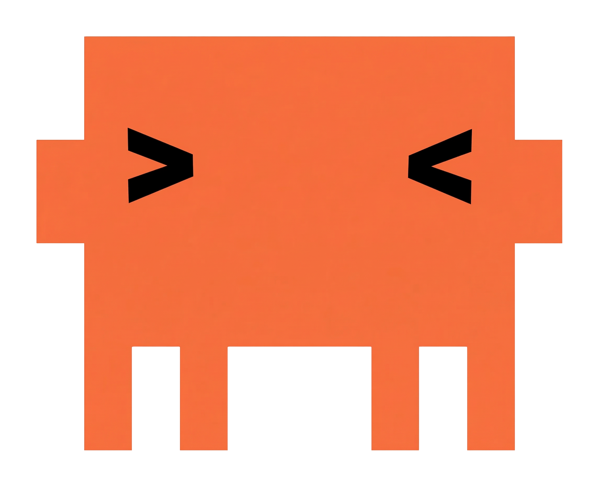
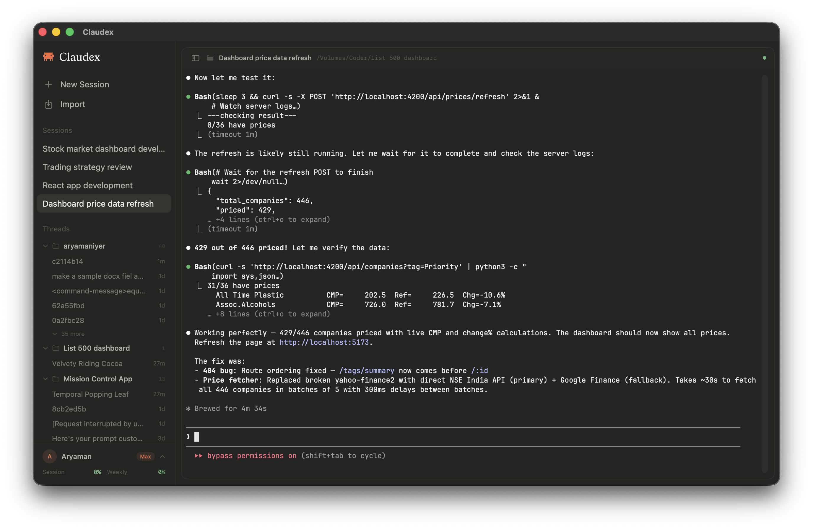

<p align="center">
  
</p>

<h1 align="center">Claudex</h1>

<p align="center">
  All Claude Code needed was a home.
</p>

<p align="center">
  <a href="https://github.com/aryamaniyer03/claudex/releases/latest">Download</a> · <a href="#build-from-source">Build from source</a> · <a href="#features">Features</a>
</p>

<p align="center">
  
</p>

## Features

- **Multi-session workspace** — All your Claude Code sessions in one window with instant switching (Cmd+Up/Down, Cmd+1-9)
- **Persistent sessions** — Sessions survive app restarts via tmux backend
- **Thread history** — Browse all past Claude Code conversations grouped by project, click to resume
- **Import from Terminal.app** — Absorb running Claude Code sessions with one click
- **File preview panel** — Preview files opened by Claude Code in a side-by-side panel
- **Drag & drop** — Drag folders from Finder into the sidebar to create new sessions
- **Usage tracking** — See your Claude API session and weekly usage at a glance
- **Auto-titling** — Sessions get descriptive titles based on what you're working on

## Download

Grab the latest DMG from the [Releases page](https://github.com/aryamaniyer03/claudex/releases/latest).

Open the DMG, drag Claudex to Applications. On first launch, right-click the app and select "Open" (required once since the app isn't notarized).

### Requirements

- macOS 14.0 (Sonoma) or later
- [tmux](https://github.com/tmux/tmux) installed via Homebrew (`brew install tmux`)
- [Claude Code](https://docs.anthropic.com/en/docs/claude-code) CLI installed and logged in (`claude login`)

## Build from source

```bash
git clone https://github.com/aryamaniyer03/claudex.git
cd claudex
./bundle.sh
```

This builds a release binary, creates `Claudex.app`, and codesigns it locally in the repo.

Optional install steps:

```bash
./bundle.sh --install-app --install-cli
```

You can also override install locations with `APP_INSTALL_DIR` and `CLI_INSTALL_DIR`.

To package a release DMG locally:

```bash
./bundle.sh --create-dmg
```

## Usage

1. **New session** — Cmd+T to pick a project folder (auto-launches Claude)
2. **Switch sessions** — Cmd+Up/Down arrows, Cmd+Shift+[/], or Cmd+1-9
3. **Import sessions** — Cmd+Shift+I to import running Claude Code sessions from Terminal.app
4. **Resume threads** — Click any conversation in the sidebar's thread history
5. **Close session** — Cmd+W

## Keyboard shortcuts

| Shortcut | Action |
|----------|--------|
| Cmd+T | New session (auto-launches Claude) |
| Cmd+W | Close session |
| Cmd+Up/Down | Navigate sessions |
| Cmd+Shift+[/] | Navigate sessions |
| Cmd+1-9 | Jump to session |
| Cmd+Shift+I | Import from Terminal.app |
| Cmd+Control+S | Toggle sidebar |
| Cmd+Control+P | Toggle preview panel |
| Cmd++/- | Font size |
| Cmd+0 | Reset font size |

## Architecture

```
SwiftUI App
├── Sidebar (sessions + thread history + usage)
├── Terminal (NSViewRepresentable → SwiftTerm → tmux)
└── Preview panel (file viewer)
```

Terminal views are owned by the model layer (`TerminalSession`), not SwiftUI. The `NSViewRepresentable` swaps terminal subviews in/out without destroying running processes.

## Configuration

### tmux

Claudex uses its own tmux socket (`terminalhub`) and config (`~/.config/terminalhub/tmux.conf`) — won't interfere with your personal tmux.

## Tech stack

- Swift + SwiftUI (macOS 14+)
- [SwiftTerm](https://github.com/migueldeicaza/SwiftTerm) v1.11.2
- tmux for session persistence
- Claude Code OAuth API for usage tracking

## License

MIT
